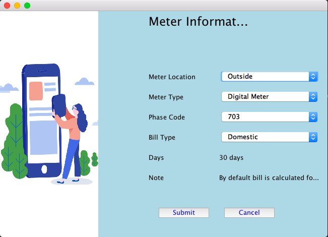

# Electric-Billing-System
Electricity Billing System is a desktop based application, developed using Java with JDBC &amp; Swing. The project aims at serving the department of electricity by computerizing the billing system. It mainly focuses on the calculation of Units consumed during the specified time and the money to be paid to electricity offices.

# Homepage

# Login page

# New user? just Signup

# Fillup all details as a New Customer

# View Profile

# Update or Change your Information

# Meter Information

# Consumed unit of Electricity

# Payment Information

# Pay your Electricity bill through Paytm

# Splash page

There are the major Screens of this Electric Billing System Project.
